<a href="https://world-of-raptors.vercel.app">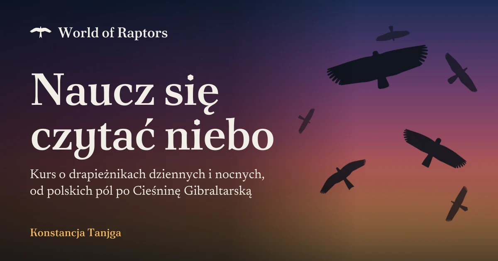</a>

# World of Raptors

Kurs online o drapieżnikach dziennych i nocnych, czyli ptakach drapieżnych i sowach: jak żyją, polują i wędrują, i jak rozpoznać je w terenie, od polskich pól po Cieśninę Gibraltarską. Napisałam go do własnej nauki. Działa w przeglądarce, bez kont i bez serwera z danymi: postęp, fiszki i obserwacje zostają w przeglądarce.

**Na żywo: [world-of-raptors.vercel.app](https://world-of-raptors.vercel.app)**

| 42 drapieżniki | 34 ptaki mokradeł | 13 modułów | 65 lekcji | 132 pytania w quizach | 282 fiszki | 363 zdjęcia |
| :---: | :---: | :---: | :---: | :---: | :---: | :---: |

## Niebo o każdej porze

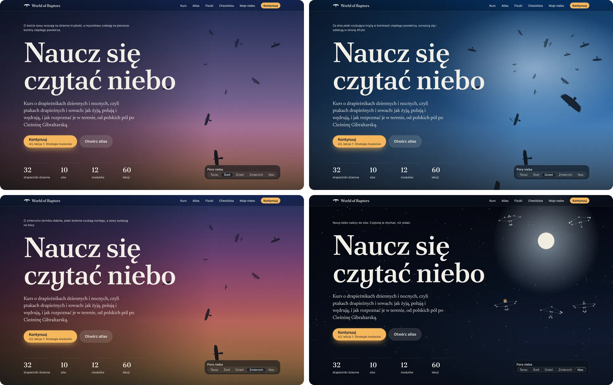

Strona startowa pokazuje niebo nad Warszawą takie, jakie jest w chwili, gdy ją otwieram: kod liczy wysokość słońca i wybiera świt, dzień, zmierzch albo noc. Za dnia w kominie ciepłego powietrza krążą ptaki szybujące przez Cieśninę Gibraltarską, wznoszą się i odlatują. To sylwetki gatunków z atlasu, widziane od spodu, tak jak uczy moduł B1. Zdanie nad tytułem zmienia się z porą roku: jesienią ptaki lecą do Afryki, wiosną na lęgowiska. Nocą świeci księżyc, czasem przelatuje sowa, a na niebie pojawiają się gwiazdozbiory modułów, które ukończyłam. Porę mogę też wybrać sama („Pora nieba”); wybór zostaje, dopóki nie wrócę do „Teraz”.

## Co jest w kursie

### Lekcje

Dwie ścieżki, trzynaście modułów, w każdym pięć lekcji:

| Ścieżka A: Biologia | Ścieżka B: Rozpoznawanie w terenie |
| :--- | :--- |
| A1&nbsp;[Kim są ptaki drapieżne?](content/moduly/kim-sa-drapiezniki/README.md) | B1&nbsp;[Metoda rozpoznawania w locie](content/moduly/metoda/README.md) |
| A2&nbsp;[Anatomia łowcy](content/moduly/anatomia/README.md) | B2&nbsp;[Ptaki drapieżne Polski](content/moduly/polska/README.md) |
| A3&nbsp;[Polowanie i ekologia](content/moduly/polowanie-i-ekologia/README.md) | B3&nbsp;[Cieśnina Gibraltarska](content/moduly/gibraltar/README.md) |
| A4&nbsp;[Rozród i życie rodzinne](content/moduly/rozrod/README.md) | B4&nbsp;[Ptaki drapieżne południa Hiszpanii](content/moduly/poludnie-hiszpanii/README.md) |
| A5&nbsp;[Wędrówki](content/moduly/wedrowki/README.md) | B5&nbsp;[Sowy, drapieżniki nocne](content/moduly/sowy/README.md) |
| A6&nbsp;[Ochrona](content/moduly/ochrona/README.md) | B6&nbsp;[Marismas del Barbate, początek października](content/moduly/barbate/README.md) |
| A7&nbsp;[Ludzie i drapieżniki](content/moduly/ludzie-i-drapiezniki/README.md) | |

<table>
  <tr>
    <td width="50%">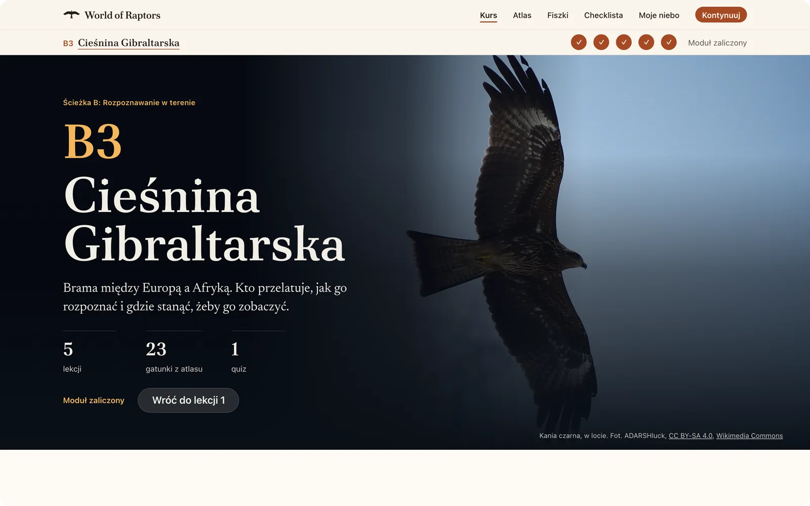</td>
    <td width="50%">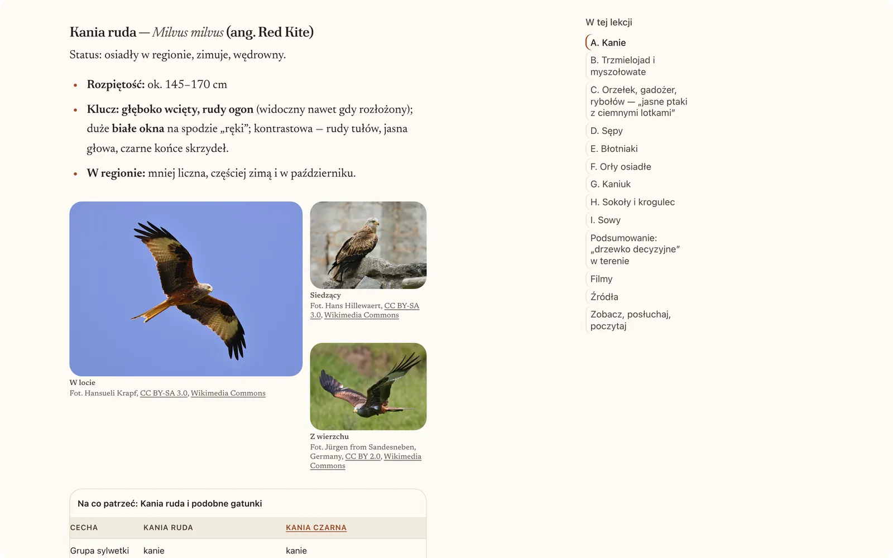</td>
  </tr>
  <tr>
    <td>Każdy moduł otwiera się zdjęciem i zajawką; nad lekcjami biegnie pasek z ich postępem.</td>
    <td>Przy gatunku lekcja dokleja jego planszę z atlasu: zdjęcia, cechy porównane z gatunkami, z którymi łatwo go pomylić, i linki.</td>
  </tr>
</table>

Lekcja to artykuł ze spisem treści, czasem czytania i marginesem na zdjęcia i notatki. Moduł kończą ćwiczenia i quiz krok po kroku: jedno pytanie na ekranie, od razu wiadomo, czy odpowiedź jest dobra, a zaliczony quiz oznacza lekcję jako ukończoną.

### Atlas gatunków

<picture>
  <source media="(prefers-color-scheme: dark)" srcset="docs/readme/atlas-sylwetki-ciemny.webp">
  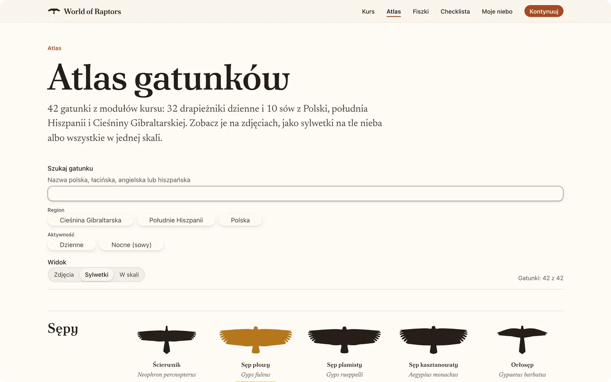
</picture>

42 gatunki: 32 drapieżniki dzienne i 10 sów. Atlas pokazuje je na zdjęciach, jako sylwetki w grupach (tych z modułu B1, do tego sowy) albo wszystkie w jednej skali. Gatunki, które widziałam, są oznaczone złotem.

Do tego 34 ptaki mokradeł z karty terenowej Marismas del Barbate (moduł B6): czaple, siewkowe, mewy, rybitwy, ptaki zarośli i ibis grzywiasty. Atlas pokazuje je po wybraniu „Ptaki mokradeł” albo miejsca „Marismas del Barbate”, tylko na zdjęciach, bo sylwetki i skala są dla drapieżników. Na checkliście karta terenowa liczy postęp, np. „17 z 42”, także w każdej grupie, a za obserwacje są naszywki w „Moim niebie”.

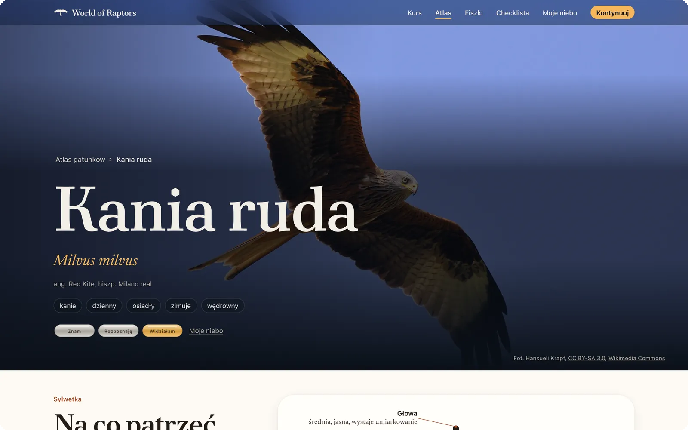

Karta gatunku ma nazwy: polską, łacińską, angielską i hiszpańską, planszę sylwetki z opisanymi cechami, rozpiętość w skali obok rozłożonych rąk człowieka, trzecie zdjęcie z cechą, która najbardziej pomaga w rozpoznaniu (np. druga płeć, młody ptak, odmiana, widok z wierzchu), gatunki podobne i moją obserwację. U drapieżników dziennych jest też sposób lotu i suwak, który zmienia jedną sylwetkę w drugą.

**Sylwetki z liczb.** Żadna sylwetka nie jest narysowana ręcznie ani wycięta ze zdjęcia. Każda to dwadzieścia kilka liczb: szerokość skrzydła przy tułowiu i w nadgarstku, liczba i głębokość „palców”, długość, wachlarz i wcięcie ogona, to, jak daleko wystaje głowa. Kod rysuje z nich ptaka widzianego od spodu, więc sylwetka może machać skrzydłami, rozkładać ogon i zmieniać się w inny gatunek.

### Fiszki

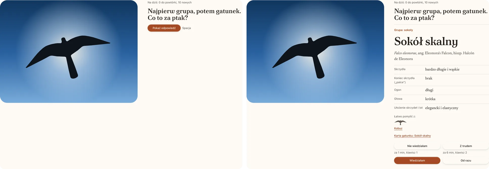

282 fiszki: ze zdjęć (82), z sylwetek w locie (32) i z nazw po polsku, angielsku i hiszpańsku (168). Powtórki układa algorytm FSRS, ten sam, który można włączyć w Anki: trudne fiszki wracają szybciej, łatwe coraz rzadziej. Każdego dnia dochodzi do 10 nowych.

### Checklista

Moja lista obserwacji: data, miejsce, notatka i własne zdjęcia, zmniejszone i bez danych EXIF i GPS. Wszystko, łącznie z postępem i fiszkami, zapisuję w jednym pliku i wczytuję na innym urządzeniu.

### Moje niebo

<picture>
  <source media="(prefers-color-scheme: dark)" srcset="docs/readme/moje-niebo-naszywki-ciemny.webp">
  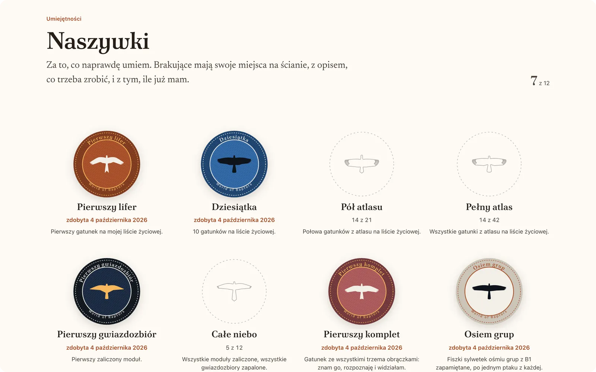
</picture>

<table>
  <tr>
    <td width="50%">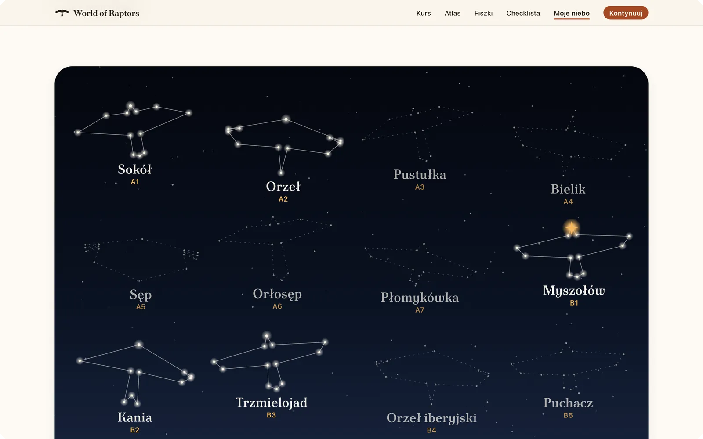</td>
    <td width="50%">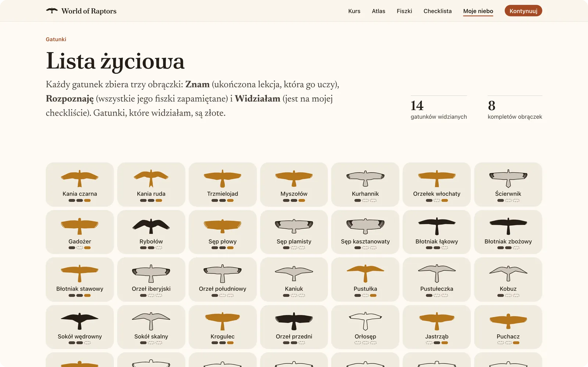</td>
  </tr>
</table>

Kolekcja liczona z tego, czego się nauczyłam i co widziałam. Zaliczony moduł zapala swój gwiazdozbiór: gwiazdy w narożnikach sylwetki ptaka, który ten moduł symbolizuje. Złota gwiazda przychodzi, kiedy rozpoznaję też ptaki, których moduł uczy. Każdy gatunek zbiera trzy obrączki: Znam, Rozpoznaję i złotą Widziałam, a za kolejne etapy i umiejętności są haftowane naszywki. Nic się nie blokuje. Zapalony gwiazdozbiór, złota gwiazda i naszywka zostają, nawet gdy później coś zapomnę; obrączki pokazują stan na dziś.

### Na telefonie

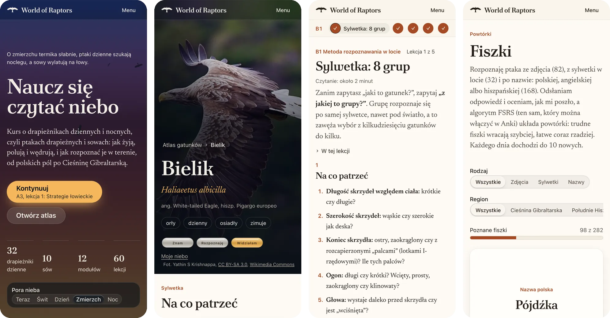

## Jak to jest zrobione

- **Treść to dane.** Lekcje to pliki Markdown, a moduły, atlas, zdjęcia i ciekawostki to pliki JSON w [`content/`](content/). Aplikacja je wyświetla, a build sprawdza, czy wszystko do siebie pasuje: czy każdy gatunek ma sylwetkę i lekcję, która go uczy albo chociaż wymienia, czy każde zdjęcie gatunku ma punkt ostrości, czy każde pytanie quizu ma dokładnie jedną dobrą odpowiedź. Literówka w danych (np. w identyfikatorze gatunku) zatrzymuje build, zamiast po cichu zgubić rysunek, fiszkę albo zdjęcie.
- **Sylwetki.** [`src/lib/sylwetka.ts`](src/lib/sylwetka.ts) rysuje ptaka z 23 proporcji, a [`src/lib/sylwetki.ts`](src/lib/sylwetki.ts) trzyma liczby każdego gatunku. Ta sama sylwetka jest statycznym SVG z serwera, animowanym SVG w przeglądarce (lot, suwak, przemiana grup) i animacją na canvasie na niebie strony startowej.
- **Niebo.** [`src/lib/niebo.ts`](src/lib/niebo.ts) liczy wysokość słońca nad Warszawą. Kolory nieba są mieszane w OKLCH i OKLab.
- **Bez kont i bez serwera z danymi.** Postęp, fiszki, checklista i „Moje niebo” są w `localStorage`, własne zdjęcia w IndexedDB. Kopia zapasowa to jeden plik.
- **Design system.** Interfejs stoi na design systemie [Big Hat](https://konstancja-tanjga.github.io/bighat-design-system/), który zaprojektowałam: kurs używa jego komponentów i ról kolorów. Kurs nadaje tym rolom własne wartości: jasny motyw „Papier terenowy” i ciemny „Zmierzch”, z kontrastem tekstu zgodnym z WCAG AA (zmierzonym w przeglądarce, także na zdjęciach i niebie). Przy `prefers-reduced-motion` ruchu jest mniej. Tytuły są złożone Półtawskim Nowym, tekst Newsreaderem.
- **Stos.** Next.js 16 (App Router), React 19, TypeScript, react-markdown, ts-fsrs. Wdrożenie na Vercelu z gałęzi `main`.

## Uruchamianie

```bash
npm install
npm run dev          # http://localhost:3000
npm run build        # build produkcyjny: sprawdza treść i generuje strony wszystkich lekcji i gatunków
npm run lint
npx tsc --noEmit
```

## Struktura

```
content/         treść kursu: plan, moduły i lekcje (Markdown), atlas, zdjęcia, ciekawostki (JSON)
src/app/         strony i arkusze stylów
src/components/  rama, lekcje, atlas, fiszki, checklista, sceny strony startowej, „Moje niebo”
src/lib/         odczyt i sprawdzanie treści, sylwetki, niebo, zapis w przeglądarce, zasady „Mojego nieba”
scripts/         wyszukiwanie zdjęć na Wikimedia Commons, podpisywanie ich autorem i licencją, zapis rozmiaru oryginałów
```

Jak dodać lekcję, moduł, gatunek, zdjęcie albo ciekawostkę: [TECH.md](TECH.md). Plan kursu: [content/PLAN-KURSU.md](content/PLAN-KURSU.md). Czego brakuje w Big Hat i jak to obchodzę: [DS-GAPS.md](DS-GAPS.md).

## Zdjęcia

Zdjęcia w kursie (ptaki, ale też miejsca i przedmioty) pochodzą z Wikimedia Commons i są na wolnych licencjach (CC BY, CC BY-SA, CC0) albo w domenie publicznej. Wyjątkiem jest jedno moje zdjęcie: pójdźka w atlasie. Przy każdym zdjęciu są autor i licencja, a na stronie [O projekcie](https://world-of-raptors.vercel.app/o-projekcie) dziękuję fotografom. Zrzuty ekranu w tym pliku pokazują część tych zdjęć, z podpisami jak w kursie.

## Autorstwo

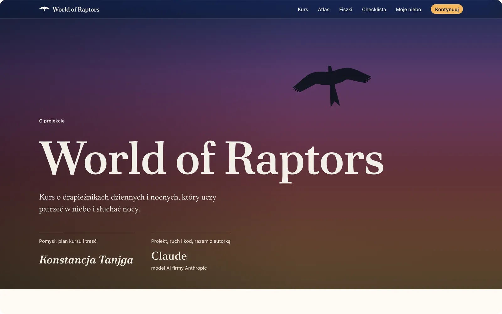

Pomysł, plan kursu i cała treść: **Konstancja Tanjga**. Projekt, ruch i kod nowej wersji powstały razem z Claude, modelem AI firmy Anthropic, w Claude Code. Szczegóły i podziękowania dla fotografów są na stronie [O projekcie](https://world-of-raptors.vercel.app/o-projekcie).
